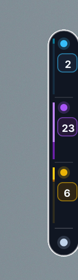
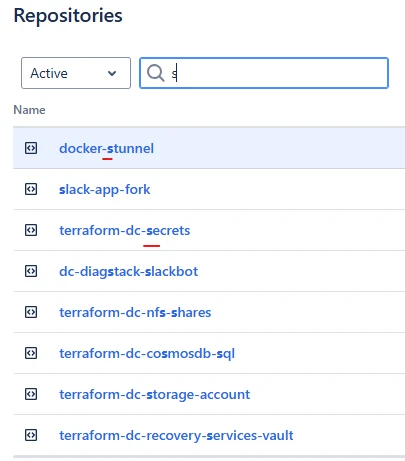
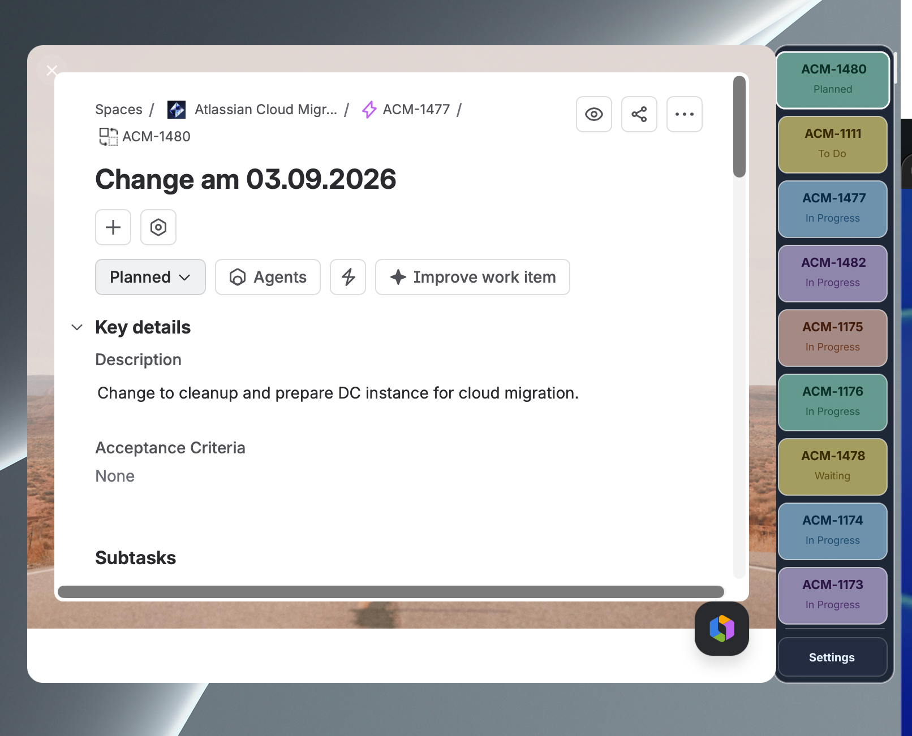
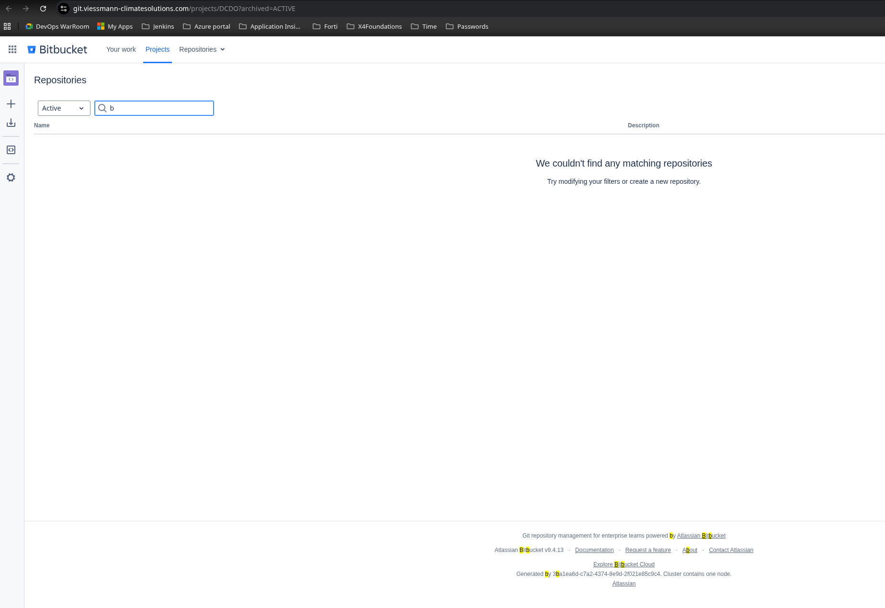

# 🚀 Jira Quick Access

Jira tickets that live at the edge of your screen. A high-performance native desktop companion built in Go with [gogpu/ui](https://github.com/gogpu/ui) and native macOS WebKit.

No dock clutter, no window to manage. Slide the pointer to the right edge and the deck fans out.

📥 **[Download for macOS (.dmg Installer)](dist/osx/Jira%20Quick%20Access-v1.0.0-macOS-Universal.dmg)** · **[macOS App Bundle & Assets](dist/osx/)**

> [!NOTE]
> **Platform Support**: Currently, **only the macOS (Darwin) version is actively tested and verified** (with native Cocoa edge docking, Retina multi-resolution icons, and embedded WebKit). Windows and Linux builds are experimental cross-compilations and not yet thoroughly tested.

---

| At rest | Fanned | A ticket pulled open |
|---|---|---|
|  |  |  |

| State | What you see | Trigger |
|---|---|---|
| **Rest** | A 32 pt discrete frosted glass capsule on the right screen edge — glowing beacons, live ticket counts, and proportional status breakdown gauges (To Do / In Progress / Done) per instance | idle |
| **Fan** | Ticket tabs shingle down the edge with instant search, multi-instance cycling, and animated Dock-style hover magnification | pointer enters the capsule |
| **Expanded** | The ticket slides open in full size via embedded hardware-accelerated WebKit, stripped of bloated Jira navigation headers, level with its own side shelf | click a tab |

---

## 📸 Settings & Multi-Instance Management



Manage credentials, multi-instance tabs (e.g. *avono cloud*, *avono DC*), custom JQL queries, connection test verification, and `.env` import.

### 💾 Where Settings & Credentials Are Stored

All instance settings, JQL queries, and credentials are saved locally on your device:

| Operating System | Configuration File Path |
|---|---|
| **macOS & Linux** | `~/.jira-quick-access/config.json` |
| **Windows** | `%USERPROFILE%\.jira-quick-access\config.json` |

You can also drop a `.env` file (see `.env.example`) directly in the app's working directory and click **Load .env** in the Settings overlay for instant credential provisioning.

---

## ✨ Features & Polish

### 🏝️ 3-State Edge Rail Architecture
- **Resting Capsule (32×224)**: Minimalist frosted glass capsule anchored to the screen edge. Features continuous 1.5px frosted white border stroke, instance beacon halos, centered count badges, and proportional gauge lines scaled against maximum workload.
- **Interactive Fan Deck (120×H)**: Vertical tabs cascade down the edge. Resting the mouse over a tab triggers an organic **macOS Dock lift effect** — sliding 4px to the left with a radiant glowing border and vibrant indicator pill.
- **Embedded WebKit Experience (780×580)**: Native macOS `WKWebView` renders the complete Jira issue directly on screen. Clean user script removes global Atlassian navigation headers, giving you pure issue content.

### 🌐 Multi-Instance Jira Support
- Manage multiple Jira Cloud & Data Center instances simultaneously.
- Color-coded instance beacons (Cyan, Purple, Amber, Emerald) and per-instance JQL filters.
- Cycle through active instances with a single click on the header pill in Fan mode.

### ⌨️ Native Shortcuts & Copy-Paste Support
Standard macOS clipboard shortcuts dispatch natively throughout embedded WebViews and input fields:

| Shortcut | Action |
|---|---|
| `⌘V` | Paste (API tokens, OTP / 2FA verification codes, text) |
| `⌘C` | Copy selected text or credentials |
| `⌘A` | Select all |
| `⌘Z` | Undo |
| `Esc` / `⌘W` | Close expanded ticket view back to tabs, or collapse Fan deck to Rest capsule |
| `Backspace` | Erase instant search query in Fan mode |
| `Tab` / `Enter` | Cycle next field in Settings overlay |

---

## 🔒 Security & Privacy

- **Local Storage Only**: Configurations and tokens are saved strictly to your local machine at `~/.jira-quick-access/config.json`.
- **Zero Telemetry**: No tracking SDKs, no external servers, no analytics.
- **Direct Atlassian API**: All requests travel directly between your machine and your configured Jira instances via TLS.
- **Token Masking**: API tokens are masked in the UI (`AT••••••••••••00`) to prevent accidental shoulder surfing.

---

## 🛠️ Multi-Platform Build & Run

Requires **Go 1.21+**. Zero external C libraries required on Windows and Linux; uses native Cocoa/WebKit on macOS.

### Quick Start:
```bash
# Run locally in development
go run .

# Run test suite
go test -v ./...
```

### Build & Installation:
The bundled `build.sh` script automates cross-compilation, icon packaging, and disk image installer creation:

```bash
# 🚀 1-Click Install to /Applications (macOS)
./build.sh install

# Build macOS Universal 2 .app bundle & .dmg installer
./build.sh osx

# Build all platforms (macOS DMG + App, Windows .exe + .zip, Linux)
./build.sh all
```

Generated artifacts are placed in `dist/`:
- `dist/osx/Jira Quick Access.app` (macOS Universal 2 App Bundle with Retina `AppIcon.icns`)
- `dist/osx/Jira Quick Access-v1.0.0-macOS-Universal.dmg` (Drag-and-Drop Disk Image Installer)
- `dist/win/jira-quick-access-windows-amd64.exe`
- `dist/lin/jira-quick-access-linux-amd64`

### 🍎 How to Install & Launch on macOS:
1. **Automated (Fastest)**: Run `./build.sh install`. This copies the app into `/Applications/`, clears quarantine flags, and makes it available system-wide in Spotlight and Launchpad.
2. **Standard macOS DMG**: Open the [Jira Quick Access DMG Installer](dist/osx/Jira%20Quick%20Access-v1.0.0-macOS-Universal.dmg) in Finder and drag the **Jira Quick Access** icon onto the **Applications** folder shortcut.
3. **Launch**: Press `⌘ + Space`, type `Jira Quick Access`, and hit `Enter`.
4. **Launch at Login (Optional)**: Open **macOS System Settings** -> **General** -> **Login Items** -> Click `+` and select `Jira Quick Access` from `/Applications`.

---

## 📁 Architecture & Layout

```
jira-quick-access/
├── main.go                     # Application entry point & window initialization
├── build.sh                    # Multi-platform build & packaging automation
├── docs/screenshots/           # UI screenshots for documentation
├── pkg/
│   ├── jira/
│   │   ├── client.go           # Multi-instance Jira REST API v3 client
│   │   ├── models.go           # Issue, InstanceConfig, Status & Theme models
│   │   ├── storage.go          # Config serialization & .env loader
│   │   └── mock.go             # Demo mock data generator
│   ├── ui/
│   │   ├── app_view.go         # 3-State root view, mouse tracking & Dock rendering
│   │   ├── theme.go            # Glassmorphic pastel palettes & design tokens
│   │   ├── components.go       # Toast notifications & UI helpers
│   │   └── settings_widget.go  # Multi-instance credentials overlay
│   └── window/
│       ├── manager_darwin.go   # macOS Cocoa edge docking, WKWebView & Edit Menu
│       ├── manager_windows.go  # Windows edge rail manager
│       └── manager_fallback.go # Linux edge rail manager
```

---

## 📄 License

MIT License — see [LICENSE](LICENSE) for details.
